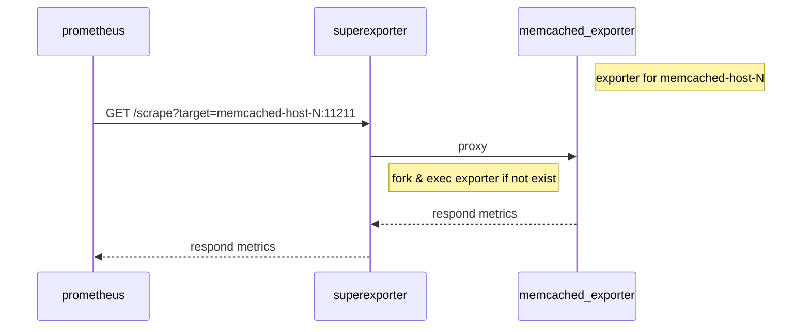

# Superexporter provides the multi-target pattern for other exporters
Superexporter is a super server for [memcached_exporter](https://github.com/prometheus/memcached_exporter) to support the multi-target pattern.
You can scrape multiple memcahed metrics from a single superexporter endpoint by specifying the target in a query parameter.


It is designed for multiple remote targets, such as SaaS managed memcached (GCP Memorystore, AWS Elasticache).

## How it works
Superexporter dynamically forks exporters for requested targets and acts as a HTTP proxy to them.

```
 \_ /bin/superexporter
     \_ /path/to/memcached_exporter --memcached.address memcached-host-a:11211 --web.listen-address localhost:45123
     \_ /path/to/memcached_exporter --memcached.address memcached-host-b:11211 --web.listen-address localhost:45321
     \_ /path/to/memcached_exporter --memcached.address memcached-host-c:11211 --web.listen-address localhost:46123
```


And it cleans up child exporters that have not been requested for several minutes.

## Running the exporter
### Docker image

```
docker run -p 9150:9150 ghcr.io/gree/superexporter:latest
```

To verify:
```
curl 'localhost:9150/scrape?target=your-memcached-host:11211'
```

### Pre-built binary

Pre-built binary is available at [the releases](https://github.com/gree/superexporter/releases).

### Build from source
#### Prerequisite
The superexporter needs the memcached_exporter executable in PATH.
You can find the released binaries on https://github.com/prometheus/memcached_exporter/releases.

#### Build and run
```
$ which memcached_exporter
/some/path/to/memcached_exporter

$ make
$ ./superexporter
```

To verify:
```
curl 'localhost:9150/scrape?target=your-memcached-host:11211'
```

### Prometheus configuration for multiple memcached hosts
Use `GET superexporter-host:9150/scrape` endpoint with `target=<memcached_addr:port>` parameter like [redis_exporter](https://github.com/oliver006/redis_exporter#prometheus-configuration-to-scrape-multiple-redis-hosts).

An example with `static_configs` is here:
```
  - job_name: memcached
    metrics_path: /scrape
    static_configs:
    - targets
      - memcached-host-a:11211
      - memcached-host-b:11211
      - memcached-host-c:11211
    relabel_configs:
    - source_labels: [__address__]
      target_label: __param_target
    - source_labels: [__param_target]
      target_label: instance
    - target_label: __address__
      replacement: superexporter-host:9150
```

Of course, you can use other `xxx_sd_config`s. For example, this is for the case for `file_sd_config`.
```
  - job_name: memcached
    metrics_path: /scrape
    file_sd_configs:
    - files:
      - target-memcached-instances.json
    relabel_configs:
    - source_labels: [__address__]
      target_label: __param_target
    - source_labels: [__param_target]
      target_label: instance
    - target_label: __address__
      replacement: superexporter-host:9150
```
Where `target-memcached-instances.json` is the following content:
```
[
  {
    "targets": [ "memcached-host-a:11211", "memcached-host-b:11211", "memcached-host-c:11211" ],
    "labels": { }
  }
]
```
